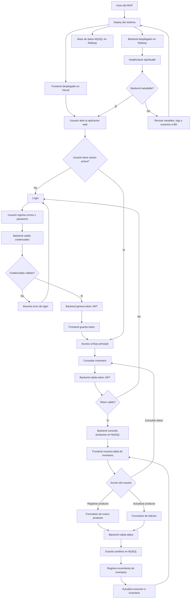
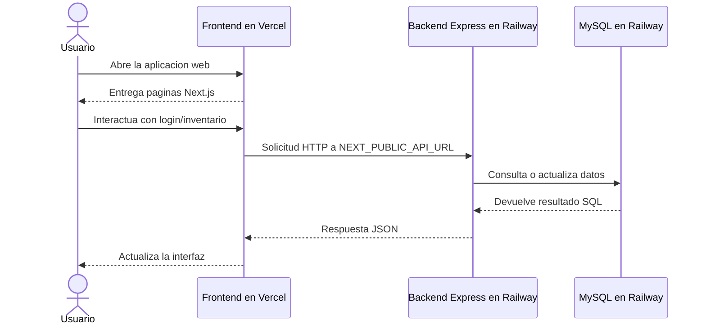
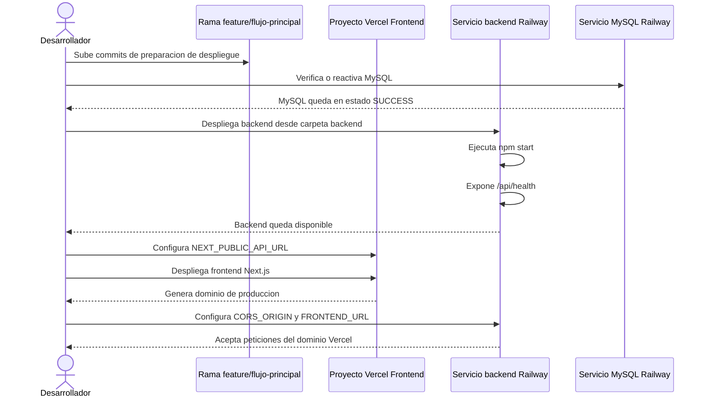
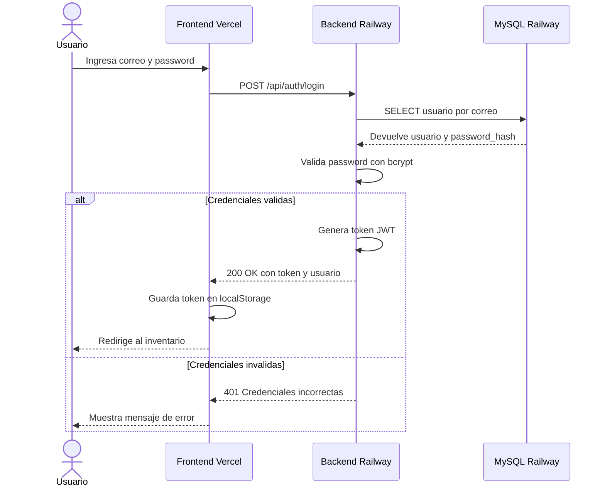
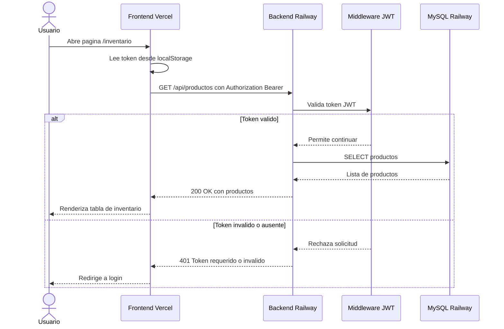
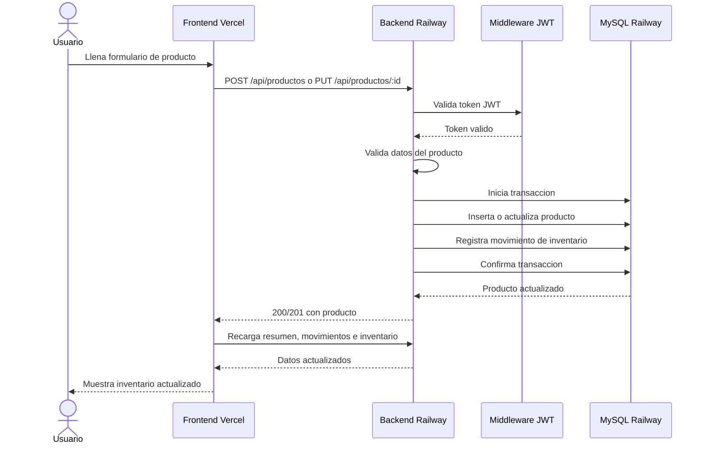
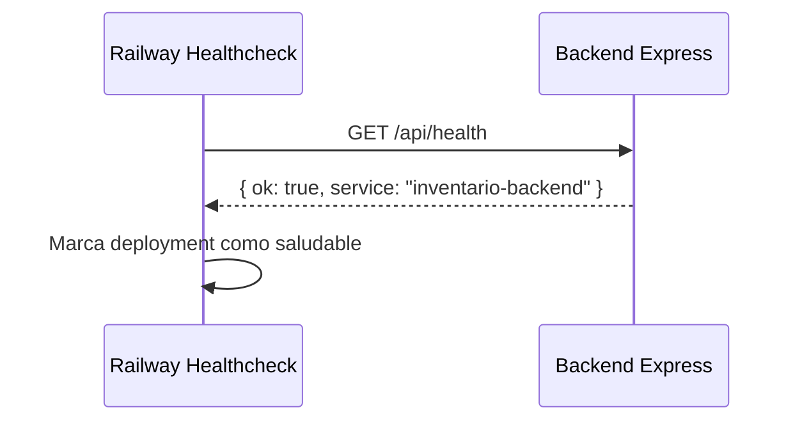

# Diagrama secuencial del despliegue y uso del sistema

Este documento describe los flujos principales del sistema despues del despliegue:

- Despliegue del frontend en Vercel.
- Despliegue del backend en Railway.
- Uso de la aplicacion por parte del usuario.
- Autenticacion y consulta de inventario.

## 0. Diagrama de flujo principal del MVP

## 1. Flujo general de arquitectura

## 2. Flujo de despliegue

## 3. Flujo de inicio de sesion

## 4. Flujo de consulta de inventario

## 5. Flujo de registro o actualizacion de producto

## 6. Flujo de healthcheck

## 7. Puntos de control para auditoria

- El frontend no consulta directamente a MySQL.
- Todas las operaciones de datos pasan por el backend.
- Las rutas de inventario requieren JWT.
- El backend valida CORS usando el dominio de Vercel.
- Railway verifica disponibilidad con `/api/health`.
- MySQL permanece aislado como servicio de base de datos en Railway.

